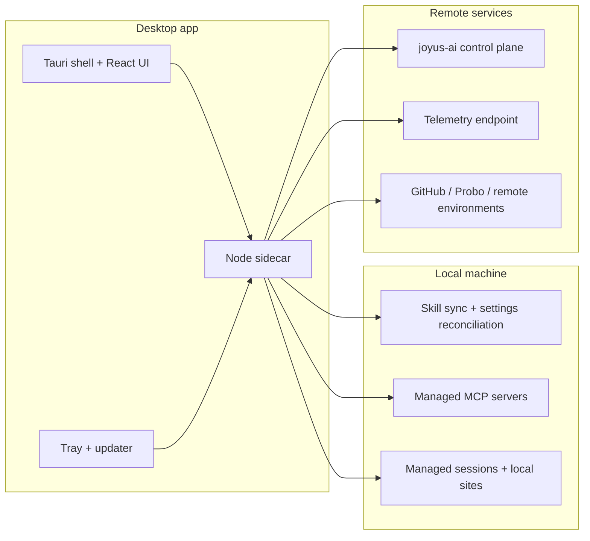

# joyus-desktop

Joyus Desktop is a pnpm monorepo for the native Joyus companion app and the shared packages behind policy enforcement, session handoff, skill and MCP distribution, managed git sessions, and local/remote environment management.



The monorepo keeps the desktop shell thin and pushes most business logic into reusable packages under `packages/`. That split is why the same repo can own the native app, sync/governance flows, and the in-progress management features without burying everything inside the Tauri app. Features `006` through `008` are still active, so the shipped surface is real but not yet complete in those areas.

## What Is In This Repo

- `apps/desktop-companion` - Tauri desktop app, React UI, native tray/update wiring, and the local sidecar process.
- `packages/policy-client` - control-plane contracts, policy checks, handoff state machine, token refresh, replay protection, and snapshot encryption.
- `packages/session-agent` - runtime routing, health signaling, and output ledger support.
- `packages/skill-sync` - managed skill distribution, metadata, version pinning, and CLI sync flows.
- `packages/desktop-sync` - local clone lifecycle and sync orchestration helpers.
- `packages/mcp-registry` - MCP registration, Claude Code integration, process management, and updater wiring.
- `packages/mcp-governance` - governance enforcement and MCP telemetry hooks.
- `packages/mcp-tools-compat` - compatibility helpers for MCP tool wrappers.
- `packages/telemetry` - CLI/Cowork telemetry collection, opt-out handling, and usage reporting.
- `packages/session-manager` - task branch storage, worktree lifecycle, close/share helpers, and file modification detection.
- `packages/drift-detector` - heuristics and topic-domain inference for session drift detection.
- `packages/local-provisioner` - local site provisioning and runtime detection for DDEV/container workflows.
- `packages/environment-monitor` - remote environment discovery, polling, identity, and activity tracking.
- `packages/settings-reconciler` - non-destructive managed settings and MCP entry reconciliation.
- `packages/updater` - update channel helpers.

## Current Status

The feature specs under `kitty-specs/` are the best status snapshot for the repo today:

| ID | Feature | Current state |
| --- | --- | --- |
| 001 | Desktop runtime policy enforcement | Complete |
| 002 | Desktop-to-cloud session handoff | Complete |
| 003 | Skill and MCP distribution | Complete |
| 004 | Desktop application shell | Complete |
| 005 | Live control plane integration | Complete |
| 006 | Managed git sessions | Complete |
| 007 | Local and remote site manager | In progress |
| 008 | Managed tooling distribution | Complete |

## Current Features

### Runtime policy and control-plane integration

- Policy-gated action authorization with allow/deny/escalate outcomes.
- Runtime routing for local vs remote execution.
- Fail-closed behavior for higher-risk actions during policy outages.
- Live control-plane client contracts, event emission, and token refresh handling.

### Desktop-to-cloud handoff

- Handoff authorization flow before any session data leaves the device.
- Snapshot assembly for session state and output artifacts.
- Snapshot encryption, integrity verification support, and resumable upload orchestration.

### Desktop companion application shell

- Tauri-based desktop shell with tray integration and updater hooks.
- Onboarding flow for auth, MCP setup, and initial sync.
- Dashboard for server health, sync status, and usage summary.
- Governance, usage, settings, and task/session views in the React app.

### Skill and MCP distribution

- Skill sync engine with distribution config parsing and version pinning.
- Local clone/sync lifecycle helpers for managed distribution.
- MCP registry, Claude Code integration, process management, and updater integration.
- Governance middleware plus telemetry emission for MCP usage.

### Managed git session foundation

- Session/task persistence with a task-branch store.
- Worktree lifecycle helpers, branch naming, and file modification detection.
- Session close helpers for push and draft PR creation flows.
- Drift detection heuristics and session UI components for resume/cleanup workflows.

### Environment and site management foundation

- Local provisioning primitives for DDEV-based sites.
- Runtime detection for Docker/OrbStack-style local environments.
- Remote environment monitoring, project discovery, and identity helpers.
- Unified site panel model for internal vs client-visible environments.

### Managed tooling distribution foundation

- Settings reconciler for managed hooks and MCP entries.
- Sidecar registry and manifest handling for managed config ownership.
- Tenant config support and fast config-check polling scaffolding.

### Quality bar

- Strict TypeScript checking.
- Vitest-based unit and integration coverage.
- CI expectation of 100% lines/functions/branches/statements coverage.

## Backlog

### Active feature backlog

- `006 Managed Git Sessions`
  - Finish the remaining worktree/session automation, drift intervention, cleanup, and share/PR flow work packages.
  - Current tracked state: 3 work packages `in_progress`, 1 `for_review`.
- `007 Local & Remote Site Manager`
  - Wire the local provisioner and environment monitor into the desktop experience for one-click local setup, remote preview visibility, and audience-specific site management.
  - Current tracked state: accepted spec, no materialized `status.json` yet.
- `008 Managed Tooling Distribution`
  - Finish manifest-driven hook/MCP reconciliation, fast revocation, tenant config propagation, and post-sync integration.
  - Current tracked state: 3 work packages `in_progress`, 4 `approved`.

### Deferred and future backlog

These are called out explicitly in `docs/rollout/known-limitations.md`:

- Per-user, per-skill granular permissions.
- Real-time collaboration features.
- Custom skill authoring UI.
- MCP server health dashboard in the companion.
- Hosted MCP relay for browser-dependent tools.
- Full offline mode for skills.
- Broader platform support beyond the current macOS-first rollout assumptions.
- Automatic recovery and supervision for crashed local MCP servers.
- Unified telemetry opt-out across Cowork and CLI.
- Hot-reload or immediate propagation for pinned skill version changes.

## Local Commands

```bash
pnpm install
pnpm typecheck
pnpm test
pnpm coverage
pnpm run ci
```

Skill-sync utilities:

```bash
pnpm skill-sync:hook:install
pnpm skill-sync:hook:preview
pnpm skill-sync:tester
pnpm skill-sync:verify-pin
```

Dogfood smoke:

```bash
pnpm dogfood:smoke
```

The smoke test reads control-plane values from `JOYUS_API_URL` before
`JOYUS_MCP_BASE_URL`, and `JOYUS_API_TOKEN` before `JOYUS_MCP_BEARER_TOKEN`.
For mediation, `JOYUS_MEDIATION_BASE_URL` overrides the control-plane URL,
`JOYUS_MEDIATION_API_KEY` overrides `API_KEY`, and
`JOYUS_MEDIATION_BEARER_TOKEN` overrides `JOYUS_DEV_JWT_TOKEN`.

## Repo Notes

- The original architecture and threat-model docs are still light and should be expanded alongside the active feature work.
- `CLAUDE.md` contains a useful package-by-package architecture summary for contributors.
- The most reliable source of roadmap truth is the combination of `kitty-specs/*`, `docs/rollout/known-limitations.md`, and the package/app source itself.
